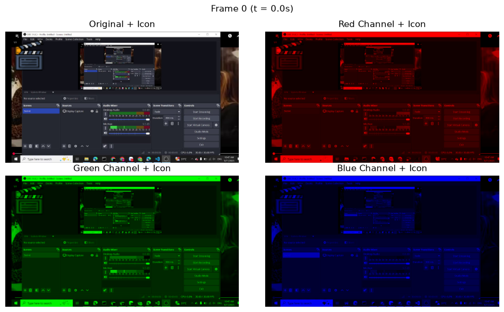

# Lab 01 – Tách kênh màu video + chèn icon

## Đề bài
Chèn một ảnh nhỏ (icon) lên video, rồi hiển thị các kênh màu kèm icon.

- **Input:** video (`data/input.mkv`) + ảnh PNG/JPG nhỏ (`data/icon_big.png`)
- **Output:** một cửa sổ 4 subplot: video gốc + 3 video cho 3 kênh R, G, B (đều có icon)

## Cách làm
1. `cv2.VideoCapture` đọc từng frame, `cv2.resize` về 640×360.
2. Đọc icon **kèm kênh alpha** (`IMREAD_UNCHANGED`) và chèn bằng **alpha blending** `α·icon + (1 − α)·frame`. Icon tự bị cắt nếu vượt khung hình.
3. `cv2.split(frame)` → `b, g, r`. Mỗi kênh được đặt vào đúng vị trí trong ảnh RGB rỗng (`red[:,:,0] = r`, ...) để hiển thị bằng chính màu của kênh đó.
4. OpenCV dùng **BGR**, Matplotlib dùng **RGB** → đảo kênh `frame[..., ::-1]` trước khi hiển thị.
5. Notebook hiển thị lưới 2×2 cho 3 frame mẫu. Hàm `play()` phát realtime trong một cửa sổ OpenCV (ghép 4 ảnh thành lưới 2×2).

> 🧭 Vì sao làm như vậy và các điểm cần lưu ý: xem [DECISIONS.md](DECISIONS.md)

## Kiến thức cần nhớ
- Ảnh màu = ma trận `H×W×3`; một kênh = ma trận `H×W` (ảnh xám).
- Thứ tự kênh BGR (OpenCV) ≠ RGB (Matplotlib/PIL).
- PNG có thể có kênh thứ 4 (**alpha** = độ đục). `cv2.imread` mặc định **bỏ** kênh này, phải dùng `cv2.IMREAD_UNCHANGED`.
- Alpha blending: `out = α·foreground + (1 − α)·background`, với α ∈ [0, 1].

## Chạy
Mở [lab01_color_channels.ipynb](lab01_color_channels.ipynb) (Jupyter / VS Code) – notebook đã có sẵn output, xem được ngay trên GitHub. Muốn chạy lại: đặt dữ liệu vào `data/` (xem [data/README.md](data/README.md)) rồi **Run All**; hình và bảng kết quả được lưu vào `outputs/`.

Notebook hiển thị các frame mẫu. Muốn xem video realtime: bỏ dấu `#` ở dòng `# play()` trong cell cuối (mở cửa sổ OpenCV, nhấn **q** để thoát).
