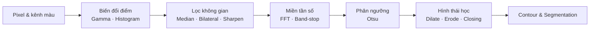

# 🖼️ Digital Image Processing (Xử lý ảnh số)

| Lab | Chủ đề | Kết quả nổi bật |
|---|---|---|
| [Lab 01](Lab01-Color-Channels-Video/) | Tách kênh màu video + chèn icon | Hiển thị realtime 4 subplot |
| [Lab 02](Lab02-Histogram-Gamma-CLAHE/) | Gamma correction, HE / AHE / CLAHE | γ = 1.50, PSNR = ∞ (trùng khớp ảnh mẫu) |
| [Lab 03](Lab03-Filtering-Denoise-Sharpen-FFT/) | Median/Bilateral, Unsharp/Laplacian, FFT band-stop | PSNR 32.7 / 45.8 / 32.0 dB |
| [Lab 04 – Final](Lab04-Final-Otsu-Morphology-Segmentation/) | Phân đoạn tài liệu: Otsu + Morphology | Tách TITLE / TEXT / PHOTO / QR |

## Lộ trình kiến thức

