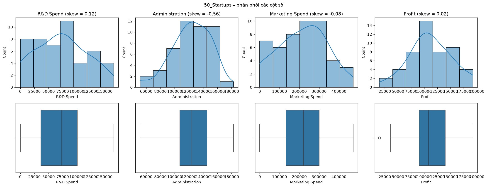
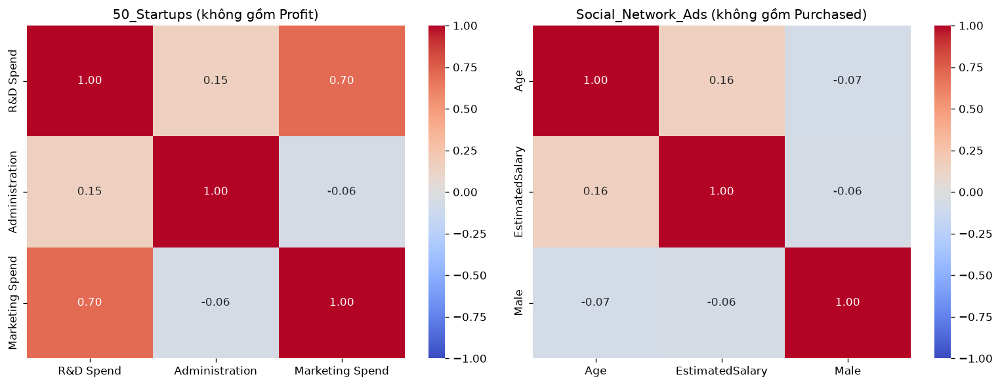

# Lab 01 – Data Understanding, Linear & Logistic Regression

## Đề bài
Yêu cầu chung cho cả 2 bài:
- Làm sạch dữ liệu (cleaning)
- Visualization: heatmap cho một số cột (**không chọn cột target**)
- Thống kê (mean, mode, median, variance) cho ít nhất 1 cột
- Chuẩn hóa dữ liệu (normalization)

| # | Bài | Input | Target | Output |
|---|---|---|---|---|
| 1 | Linear Regression | `50_Startups.csv` | `Profit` | RMSE |
| 2 | Logistic Regression | `Social_Network_Ads.csv` | `Purchased` | F1-Score + Confusion Matrix |

## Cách làm
1. **Kiểm tra chất lượng:** `50_Startups` thiếu 7 ô (R&D 2, Administration 3, Marketing 2), `Social_Network_Ads` thiếu 17 ô `EstimatedSalary`, không có dòng trùng. Bỏ `User ID`.
2. **Thống kê mô tả** trên dữ liệu thật (chưa điền thiếu): mean, median, mode, variance, std, IQR, **skewness**, outlier (IQR). Thêm thống kê cho cột phân loại → [outputs/statistics.md](outputs/statistics.md).
3. **Heatmap** tương quan các feature, không gồm target.
4. **Chuẩn hóa:** `StandardScaler` chỉ trên feature, fit trên tập train.
5. **Mô hình** – mọi bước điền thiếu (median) + chuẩn hóa nằm trong `Pipeline`, chọn feature bằng 5-fold cross-validation:
   - Linear Regression: `R&D Spend`, `Administration`, `Marketing Spend`.
   - Logistic Regression: `Age`, `EstimatedSalary`, chia train/test **stratified**.

## Kết quả
| Bài | Chỉ số | Giá trị |
|---|---|---|
| Linear Regression | RMSE (test) | **11 943.48** |
| Logistic Regression | F1 (test) | **0.7451** |
| Logistic Regression | F1 (5-fold CV trên train) | 0.7589 ± 0.0727 |
| Logistic Regression | Confusion Matrix | `[[48, 3], [10, 19]]` |

> 🧭 Vì sao làm như vậy, kiểm chứng tham số và các điểm cần lưu ý: xem [DECISIONS.md](DECISIONS.md)

## Kiến thức cần nhớ
- **RMSE** = √(mean((y − ŷ)²)): cùng đơn vị với target, phạt nặng sai số lớn.
- **F1** = 2·P·R/(P+R): dùng khi lớp mất cân bằng (tốt hơn accuracy).
- Confusion matrix sklearn: `[[TN, FP], [FN, TP]]`.
- **Skewness** đo độ lệch không phụ thuộc đơn vị đo. Dấu hiệu "mean > median → lệch phải" chỉ là gợi ý, không đủ để kết luận.
- **Data leakage:** mọi thứ "học" từ dữ liệu (median để điền thiếu, mean/std để chuẩn hóa) phải fit trên train. `Pipeline` đảm bảo điều này kể cả khi cross-validation.
- Linear Regression (OLS) **không** thay đổi dự đoán khi chuẩn hóa X. Logistic Regression của sklearn có regularization L2 nên **có** bị ảnh hưởng.
- Với tập test nhỏ (10 hoặc 80 mẫu), kết quả một lần chia rất dao động → dùng **cross-validation** để chọn mô hình/feature.

## Chạy
Mở [lab01_eda_regression.ipynb](lab01_eda_regression.ipynb) (Jupyter / VS Code) – notebook đã có sẵn output, xem được ngay trên GitHub. Muốn chạy lại: đặt dữ liệu vào `data/` (xem [data/README.md](data/README.md)) rồi **Run All**; hình và bảng kết quả được lưu vào `outputs/`.
