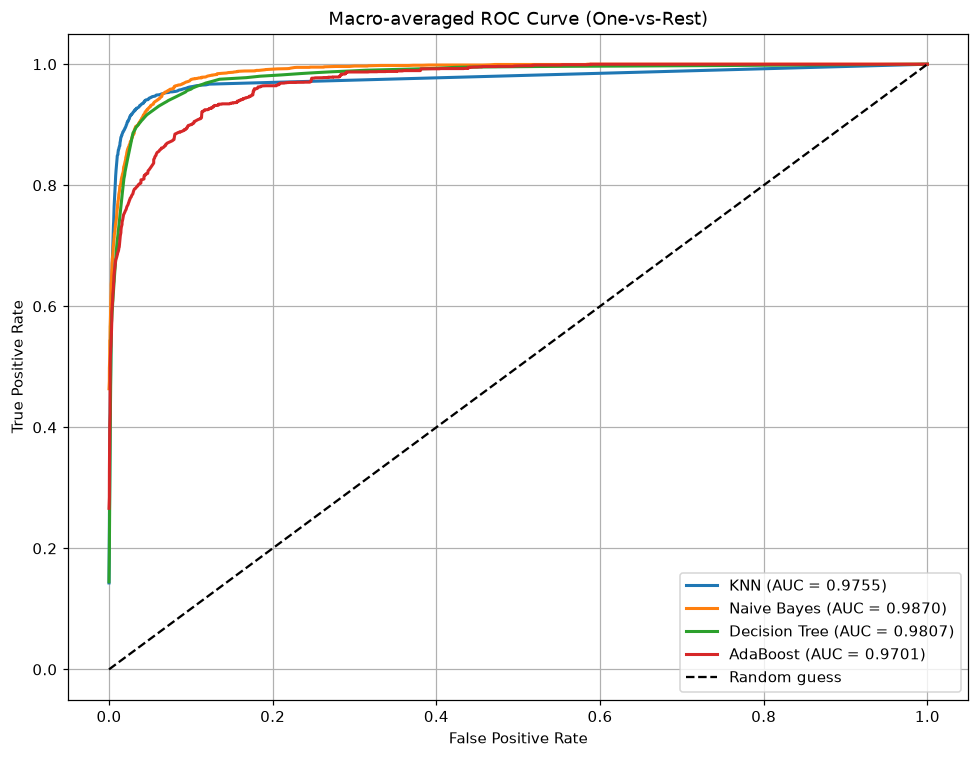

# Lab 02 – Phân loại đậu khô (Dry Bean): KNN, Naive Bayes, Decision Tree, AdaBoost

## Đề bài
Phân loại cột **`Class`** với **ít nhất 7 feature** bằng KNN, AdaBoost/Cascade, Naïve Bayes, Decision Tree.
- **Input:** `Dry_Bean_Dataset.xlsx` (13 611 mẫu, 7 loại đậu). Chia 80/20 hoặc 70/30.
- **Output:** F1-Score, Confusion Matrix, AUC cho tất cả mô hình.
- (Tùy chọn) trực quan hóa + làm sạch dữ liệu.

## Cách làm
- Kiểm tra dữ liệu: không thiếu giá trị. Vẽ phân bố lớp: mất cân bằng, DERMASON 3 546 mẫu so với BOMBAY 522.
- 8 feature hình học: `Area, Perimeter, MajorAxisLength, MinorAxisLength, AspectRation, Eccentricity, ConvexArea, EquivDiameter`.
- Chia 80/20 **stratified** (`random_state=42`) **trước**, rồi `StandardScaler` trong pipeline (fit trên train).
- Mô hình:
  - KNN: `n_neighbors=5, weights='distance'`
  - Gaussian Naive Bayes: `var_smoothing=1e-8`
  - Decision Tree: `max_depth=6`
  - AdaBoost: 100 cây `max_depth=2`, `learning_rate=0.5`
- AUC đa lớp tính theo **One-vs-Rest**. ROC vẽ dạng **macro-average**.

## Kết quả
| Mô hình | F1 (weighted) | AUC (OvR) |
|---|---|---|
| **KNN** | **0.9030** | 0.9755 |
| Decision Tree | 0.8810 | 0.9807 |
| AdaBoost | 0.8802 | 0.9701 |
| Naive Bayes | 0.8737 | **0.9870** |

Chi tiết + confusion matrix: [outputs/models_performance_report.md](outputs/models_performance_report.md)

> 🧭 Vì sao làm như vậy, kiểm chứng tham số và các điểm cần lưu ý: xem [DECISIONS.md](DECISIONS.md)

## Kiến thức cần nhớ
- **KNN:** phi tham số, dựa vào khoảng cách nên **bắt buộc chuẩn hóa**. `weights='distance'` cho láng giềng gần ảnh hưởng nhiều hơn.
- **Naive Bayes:** giả định các feature độc lập có điều kiện. Gaussian NB dùng cho feature liên tục.
- **Decision Tree:** dễ diễn giải. `max_depth` chống overfitting. Không cần chuẩn hóa.
- **AdaBoost:** ghép nhiều weak learner (cây nông), tăng trọng số cho mẫu bị phân loại sai.
- **F1 vs AUC:** F1 đo tại một ngưỡng quyết định; AUC đo khả năng xếp hạng trên mọi ngưỡng.
- **Macro vs micro average:** macro = trung bình đều các lớp; micro = gộp mọi mẫu rồi mới tính.

## Chạy
Mở [lab02_classification_drybean.ipynb](lab02_classification_drybean.ipynb) (Jupyter / VS Code) – notebook đã có sẵn output, xem được ngay trên GitHub. Muốn chạy lại: đặt dữ liệu vào `data/` (xem [data/README.md](data/README.md)) rồi **Run All**; hình và bảng kết quả được lưu vào `outputs/`.
