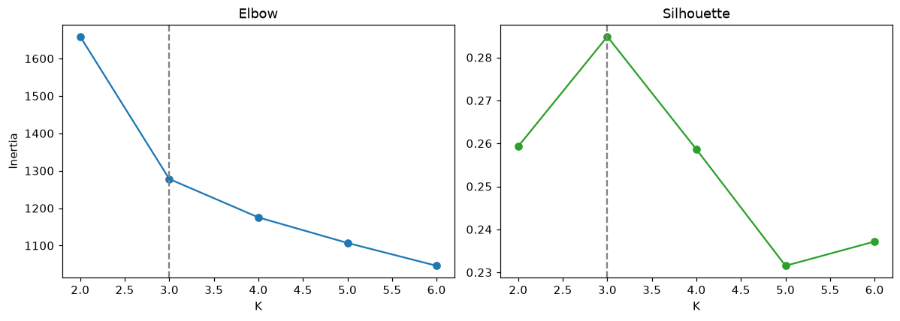
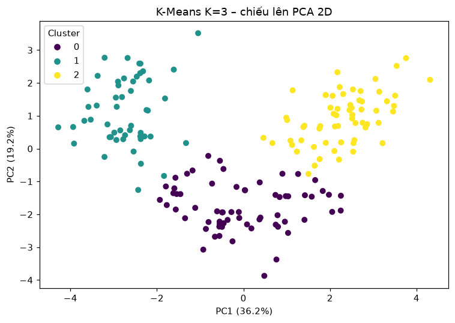

# Bài 1 – Wine Clustering (K-Means)

## Chọn K (13 feature đã chuẩn hóa)

|   K |   Inertia |   Silhouette |
|----:|----------:|-------------:|
|   2 | 1658.7589 |       0.2593 |
|   3 | 1277.9285 |       0.2849 |
|   4 | 1175.3519 |       0.2586 |
|   5 | 1107.0073 |       0.2315 |
|   6 | 1046.0023 |       0.2372 |

→ **K tối ưu = 3**

## PCA có giúp phân cụm tốt hơn? (K = 3)

| Không gian phân cụm   |   Variance giữ lại |   Silhouette (đo trên 13 chiều) |   Silhouette (đo trong không gian phân cụm) |
|:----------------------|-------------------:|--------------------------------:|--------------------------------------------:|
| 13 feature gốc        |             1.0000 |                          0.2849 |                                      0.2849 |
| PCA 2 chiều           |             0.5541 |                          0.2831 |                                      0.5611 |
| PCA 3 chiều           |             0.6653 |                          0.2840 |                                      0.4532 |
| PCA 4 chiều           |             0.7360 |                          0.2819 |                                      0.4066 |
| PCA 5 chiều           |             0.8016 |                          0.2849 |                                      0.3691 |
| PCA 6 chiều           |             0.8510 |                          0.2849 |                                      0.3463 |

## Mô hình cuối

- Silhouette: **0.2849**
- Kích thước cụm: {0: 65, 1: 51, 2: 62}

Tâm cụm (giá trị gốc):

|   Cluster |   Alcohol |   Malic_Acid |   Ash |   Ash_Alcanity |   Magnesium |   Total_Phenols |   Flavanoids |   Nonflavanoid_Phenols |   Proanthocyanins |   Color_Intensity |   Hue |   OD280 |   Proline |
|----------:|----------:|-------------:|------:|---------------:|------------:|----------------:|-------------:|-----------------------:|------------------:|------------------:|------:|--------:|----------:|
|         0 |     12.25 |         1.90 |  2.23 |          20.06 |       92.74 |            2.25 |         2.05 |                   0.36 |              1.62 |              2.97 |  1.06 |    2.80 |    510.17 |
|         1 |     13.13 |         3.31 |  2.42 |          21.24 |       98.67 |            1.68 |         0.82 |                   0.45 |              1.15 |              7.23 |  0.69 |    1.70 |    619.06 |
|         2 |     13.68 |         2.00 |  2.47 |          17.46 |      107.97 |            2.85 |         3.00 |                   0.29 |              1.92 |              5.45 |  1.07 |    3.16 |   1100.23 |

