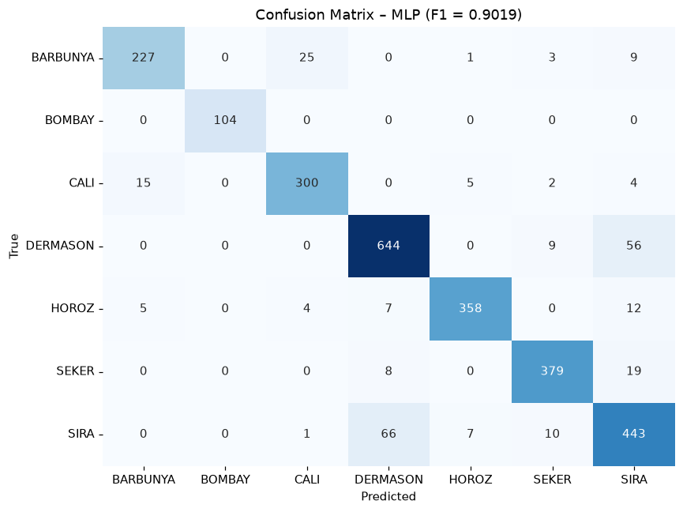

# Bài 3 – ANN Classification (Dry Bean)

- **F1-Score (Weighted): 0.9019**
- Hidden layers (100, 50), số vòng lặp 43/300

## Confusion Matrix

```
          BARBUNYA  BOMBAY  CALI  DERMASON  HOROZ  SEKER  SIRA
BARBUNYA       227       0    25         0      1      3     9
BOMBAY           0     104     0         0      0      0     0
CALI            15       0   300         0      5      2     4
DERMASON         0       0     0       644      0      9    56
HOROZ            5       0     4         7    358      0    12
SEKER            0       0     0         8      0    379    19
SIRA             0       0     1        66      7     10   443
```


