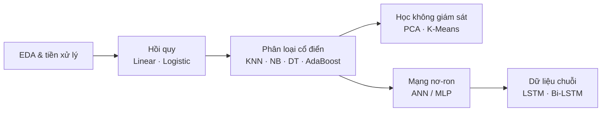

# 🤖 Machine Learning

| Lab | Chủ đề | Kết quả nổi bật |
|---|---|---|
| [Lab 01](Lab01-EDA-Linear-Logistic-Regression/) | EDA, Linear & Logistic Regression | RMSE = 11 943.48 · F1 = 0.7451 |
| [Lab 02](Lab02-Classification-DryBean/) | KNN, Naive Bayes, Decision Tree, AdaBoost | KNN F1 = 0.9030 · NB AUC = 0.9870 |
| [Lab 03 – Final](Lab03-Final-Clustering-ANN-LSTM/) | K-Means (+ PCA), ANN, Bi-LSTM | K = 3 · ANN F1 = 0.9019 · Bi-LSTM F1 = 0.8499 |

## Lộ trình kiến thức

