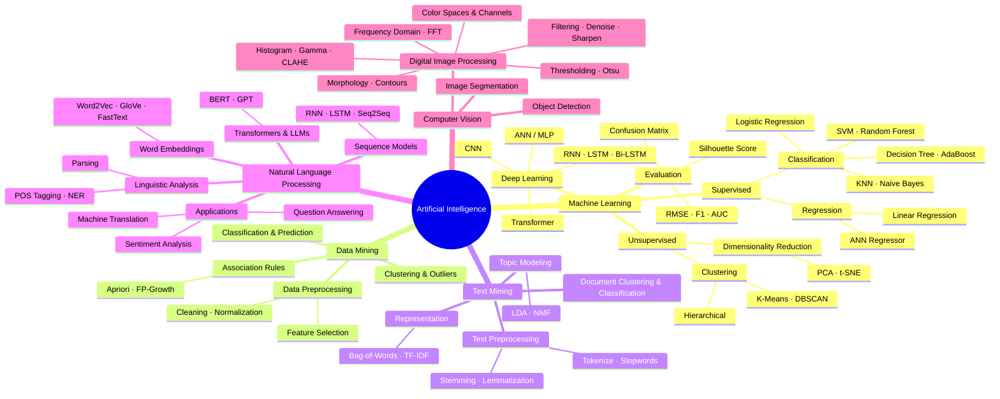
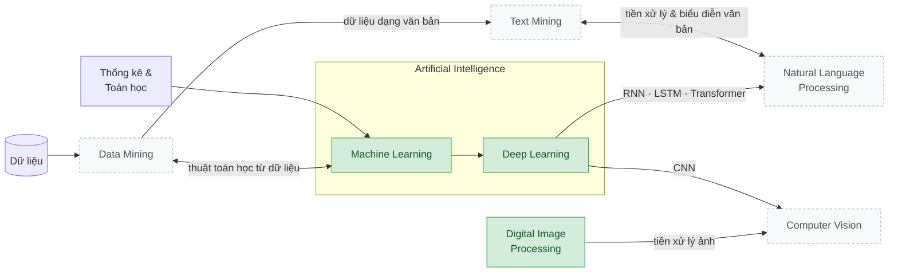

# 📊 Data Analysis Labs

Tổng hợp các bài lab (đã chấm, đạt điểm tối đa) trong các môn thuộc mảng **Phân tích dữ liệu & Trí tuệ nhân tạo**: Xử lý ảnh số, Machine Learning, Data Mining, Text Mining và NLP. Mỗi lab gồm code chạy được, kết quả, phần **“Kiến thức cần nhớ”** để ôn tập nhanh và `DECISIONS.md` giải thích vì sao làm như vậy.

> Tác giả: **Trần Hoàng Đạt** · [GitHub @TranHoangDatSC](https://github.com/TranHoangDatSC)

---

## 🗺️ Bức tranh tổng thể các lĩnh vực



### Các lĩnh vực giao nhau như thế nào



<sub>🟩 Đã có lab trong repo · ⬜ Sẽ bổ sung</sub>

---

## 📁 Danh sách bài lab

### 🖼️ [Digital Image Processing](Digital-Image-Processing/)
| Lab | Chủ đề | Kỹ thuật chính |
|---|---|---|
| [Lab 01](Digital-Image-Processing/Lab01-Color-Channels-Video/) | Tách kênh màu video + chèn icon | `VideoCapture`, BGR↔RGB, `cv2.split` |
| [Lab 02](Digital-Image-Processing/Lab02-Histogram-Gamma-CLAHE/) | Gamma & cân bằng histogram | Gamma LUT, PSNR, HE, AHE, CLAHE |
| [Lab 03](Digital-Image-Processing/Lab03-Filtering-Denoise-Sharpen-FFT/) | Khử nhiễu, làm nét, lọc tần số | Median, Bilateral, Unsharp, Laplacian, FFT band-stop |
| [Lab 04 – Final](Digital-Image-Processing/Lab04-Final-Otsu-Morphology-Segmentation/) | Phân đoạn trang tài liệu | Otsu, Morphology, Contours, QR detector (tự cài bằng NumPy) |

### 🤖 [Machine Learning](Machine-Learning/)
| Lab | Chủ đề | Kỹ thuật chính |
|---|---|---|
| [Lab 01](Machine-Learning/Lab01-EDA-Linear-Logistic-Regression/) | EDA + hồi quy | Cleaning, heatmap, thống kê, Linear & Logistic Regression |
| [Lab 02](Machine-Learning/Lab02-Classification-DryBean/) | Phân loại Dry Bean | KNN, Naive Bayes, Decision Tree, AdaBoost, F1/AUC |
| [Lab 03 – Final](Machine-Learning/Lab03-Final-Clustering-ANN-LSTM/) | Clustering, ANN, LSTM | K-Means (+ PCA), ANN regression/classification, Bi-LSTM sentiment |

### ⛏️ [Data Mining](Data-Mining/) · 📝 [Text Mining](Text-Mining/) · 💬 [Natural Language Processing](Natural-Language-Processing/)
_Sẽ cập nhật._

---

## 🧱 Cấu trúc chuẩn của một lab

```
LabXX-Ten-Chu-De/
├── README.md        # Đề bài · cách làm · kết quả · kiến thức cần nhớ
├── DECISIONS.md     # Vì sao làm như vậy · đối chiếu đề → code · điểm cần lưu ý khi ôn
├── main.py | exN_*.py
├── data/            # dữ liệu đầu vào – KHÔNG có trên GitHub, xem data/README.md để biết cần tải gì
└── outputs/         # kết quả do code sinh ra (ảnh, báo cáo .md)
```

Mọi script dùng đường dẫn tương đối theo vị trí file, nên có thể chạy từ bất kỳ thư mục nào.

## ⚙️ Cài đặt

```bash
python -m venv .venv
.venv\Scripts\activate          # Windows  (Linux/macOS: source .venv/bin/activate)
pip install -r requirements.txt
```
